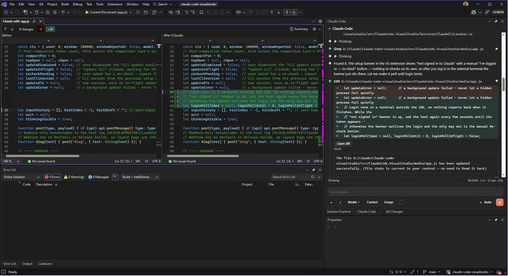
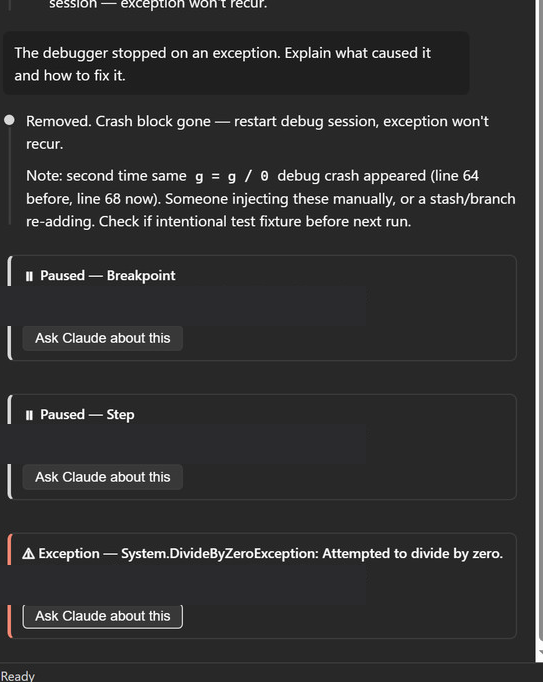
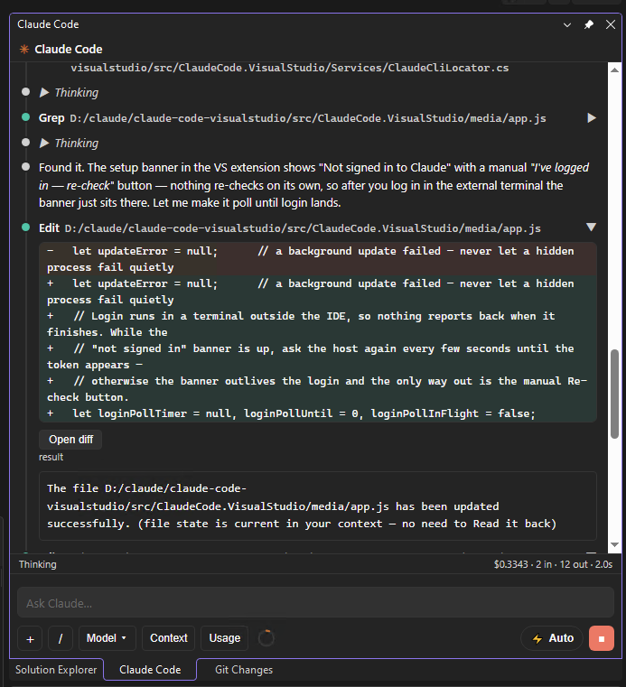
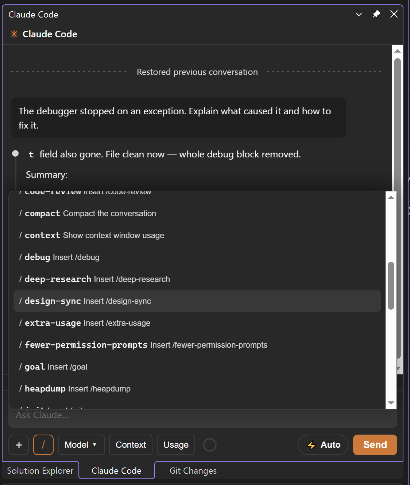
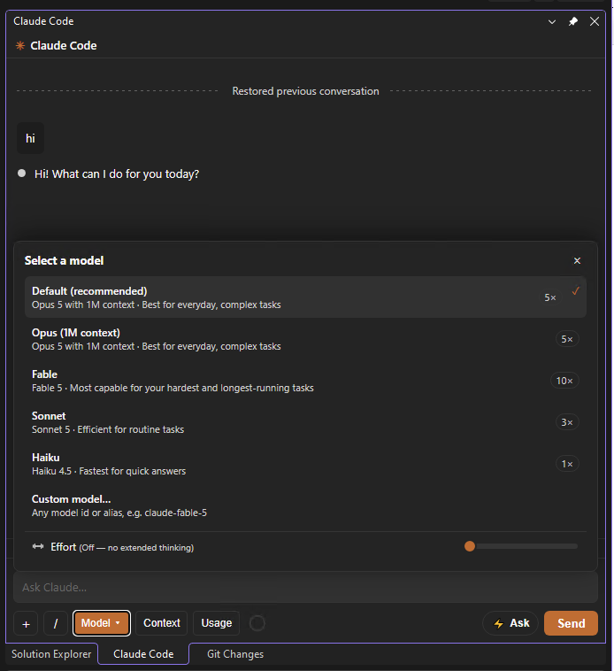
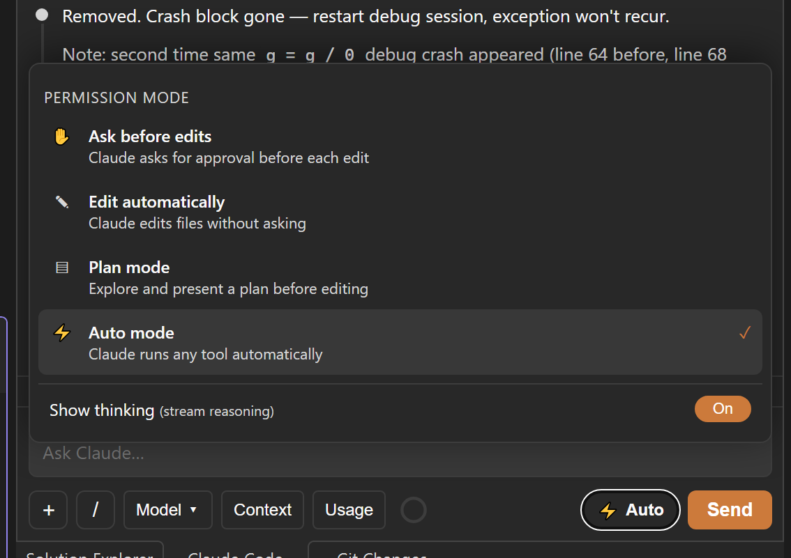
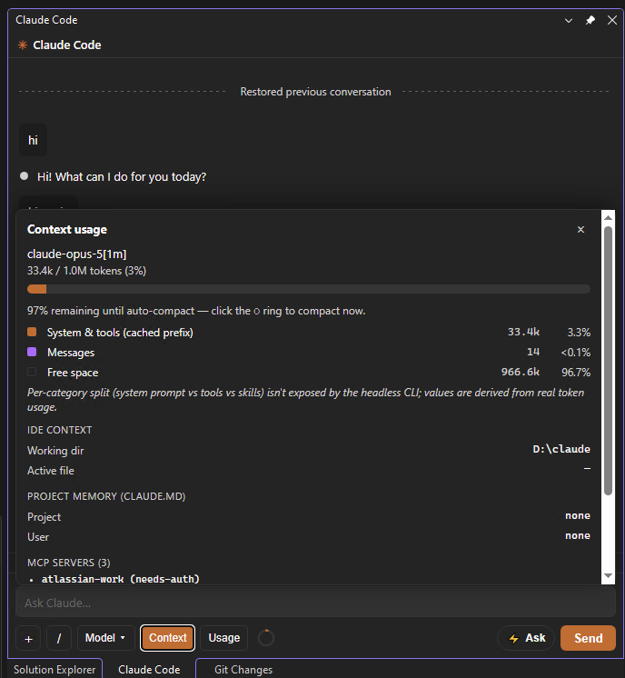
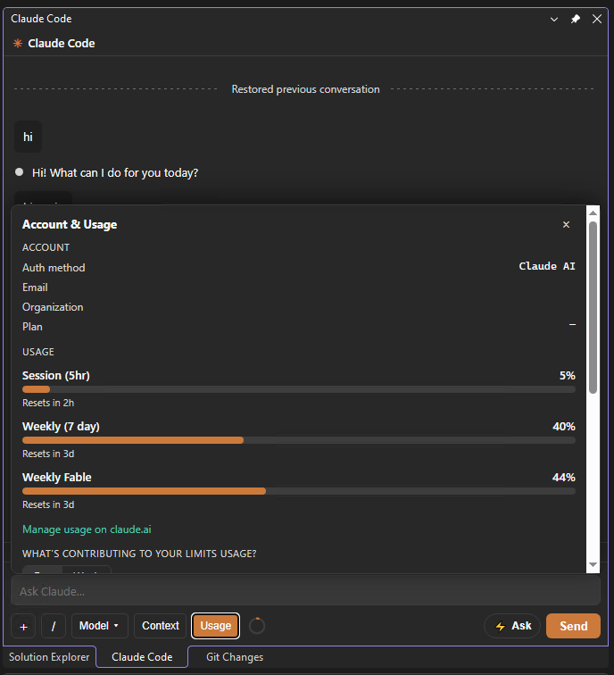
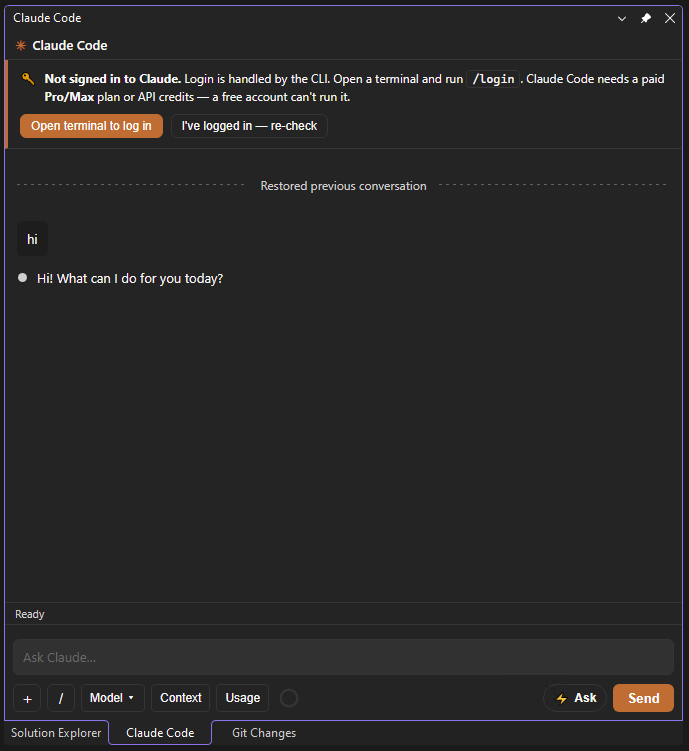

# Claude Code for Visual Studio

> **Latest release:** <!-- managed:version -->v1.0.9<!-- /managed:version --> — [download the VSIX from Releases](https://github.com/nachum-shmilovitz-66/claude-code-visualstudio/releases/latest)

Brings the [Claude Code](https://www.anthropic.com/claude-code) agentic coding assistant into
**Visual Studio 2026, 2022, 2019, and 2017** as a native tool-window chat — the same kind of
experience as the VS Code extension. It drives the real `claude` CLI under the hood, so you get
the full agent: streaming responses, tool use, file edits, and multi-turn conversations, scoped
to your open solution.

> Status: **working core.** See the [Feature parity](#feature-parity) matrix for exactly
> what is implemented.

> **Unofficial community project.** Not affiliated with or endorsed by Anthropic. "Claude" and
> "Claude Code" are products of Anthropic; you need your own Claude Code subscription/credentials.

---

## Screenshots



*The Claude Code panel docked on the right — ask, and Claude reads and edits your code. Each edit shows inline in the chat and opens in the native VS Before/After diff, with the model, permission mode, and reasoning effort all in the composer.*

### Debug-aware: reads your running code to find the root cause

When the debugger is **paused** at a breakpoint or exception, Claude reads the **live runtime** — call stack, locals, arguments, and the thrown exception — and reasons about *why* the code broke, not just the static source. Every pause drops an **"Ask Claude about this"** banner so you can hand the live state straight to Claude.

> Verified with **C#/.NET**. Other languages Visual Studio can debug (e.g. C / C++) are expected to work but are **not yet tested**.



### Inline diffs, slash commands, and full composer control

<table>
<tr>
<td width="50%"><br><sub>Inline red/green diff per edit, plus "Open diff" for the native VS Before/After window.</sub></td>
<td width="50%"><br><sub>The <code>/</code> palette — built-in commands plus your own CLI slash commands.</sub></td>
</tr>
<tr>
<td><br><sub>Pick the model (latest Opus / Fable / Sonnet / Haiku, or a custom id) and per-model reasoning effort.</sub></td>
<td><br><sub>Ask before edits, edit automatically, plan mode, or full auto — plus a thinking-stream toggle.</sub></td>
</tr>
<tr>
<td><br><sub>Live context-window breakdown, IDE context, project memory, and MCP servers.</sub></td>
<td><br><sub>Your Claude plan's session and weekly usage, read from the CLI login.</sub></td>
</tr>
</table>

---

## How it works

```
┌────────────────────────── Visual Studio (devenv) ──────────────────────────┐
│                                                                            │
│  Tool window ──► WebView2 (HTML/JS chat UI) ◄──► WebViewHost (JSON bridge) │
│                                                │                           │
│                                        ClaudeChatControl                   │
│                                          │           │                     │
│      IdeContextService ◄─────────────────┘           └──► ClaudeSession    │
│      ThemeService                                               │          │
│      (DTE / Roslyn / VSColorTheme)                              ▼          │
│                                                                            │
└─────────────────────────────────────────────────────────────────┬──────────┘
                                                                  │ stdin/stdout
                                                    stream-json (NDJSON)
                                                                  ▼
                                              claude CLI (Node, your login)
```

- **WebView2** hosts the chat UI (served from a virtual host, so it looks/behaves like the VS Code panel).
- **`ClaudeSession`** spawns a long-lived `claude --print --input-format stream-json --output-format stream-json`
  process and speaks the bidirectional stream-json protocol: it writes your turns to stdin and parses the
  streamed `stream_event` / `tool_use` / `tool_result` / `result` events from stdout.
- **`IdeContextService`** reads your active file + selection from the editor and auto-attaches them as context;
  it also opens files Claude edits.
- **`ThemeService`** maps the current VS theme to the chat UI's colors.

The agent itself is the real Claude Code CLI, so it uses **your existing login**, your `CLAUDE.md`,
your MCP servers, hooks, and settings — exactly like running `claude` in a terminal.

---

## Prerequisites

> This extension is a **thin UI over the real Claude Code CLI** — it shells out to *your* locally
> installed `claude` and inherits its install, login, plan, `CLAUDE.md`, MCP servers, and settings.
> It **does not bundle or install the CLI**, and it can't sign you in for you. The three things you
> must provide are the CLI, a login, and a paid plan.

1. **Visual Studio 2026 (18.x)**, **2022 (17.x)**, **2019 (16.x)**, or **2017 (15.7+)** — Community, Professional, or Enterprise.
2. **Node.js** and the **Claude Code CLI** installed and on `PATH`:
   ```powershell
   npm install -g @anthropic-ai/claude-code
   claude --version
   ```
3. **Logged in once** — run `claude` in any terminal and complete login (`/login`) so the CLI has credentials.
4. **A paid Claude plan or API credits** — Claude Code requires a **Pro/Max** subscription or
   billed **API** access. A **free** Anthropic account can't run it; turns will fail with an
   auth/entitlement error until the account has Claude Code access.
5. **WebView2 Runtime** — already present on Windows 11 and with Visual Studio; otherwise install the
   [Evergreen runtime](https://developer.microsoft.com/microsoft-edge/webview2/).

### First run — the panel guides you

When you open **View ▸ Claude Code**, the panel checks readiness and shows a banner if something's
missing, so you're never left at a raw error:

- **"Claude CLI not found"** → if npm is present, an **Install CLI** button runs
  `npm install -g @anthropic-ai/claude-code` in a **visible terminal** (consented, never silent);
  otherwise a **Get Node.js** link. Then click **Re-check** — a VS restart may be needed so the new
  `claude` is on VS's PATH. (The extension never installs the CLI silently.)
- **"Not signed in to Claude"** → an **Open terminal to log in** button launches `claude` in a console
  at your folder; run `/login` there. The login happens outside the IDE, so the panel watches for it
  and clears the banner on its own once the credentials land — there's an **I've logged in — re-check**
  button too, but you shouldn't need it.
- Failed turns that look like auth/credit problems surface the same **log in** action and a note that
  Claude Code needs a paid plan.



---

## Install

### From a release VSIX (recommended)
1. Download the VSIX for your Visual Studio from the
   [Releases page](https://github.com/nachum-shmilovitz-66/claude-code-visualstudio/releases/latest):
   - `ClaudeCode.VisualStudio-vs2022-2026.vsix` — VS 2022 / 2026 (amd64)
   - `ClaudeCode.VisualStudio-vs2019.vsix` — VS 2019 (16.x, x86)
   - `ClaudeCode.VisualStudio-vs2017.vsix` — VS 2017 15.7+ (15.x, x86)
2. Double-click the `.vsix` and let the **VSIX Installer** add it.
   (The VSIX is community-built and unsigned, so VS shows a "publisher not verified" prompt — click **Install**.)
3. Restart Visual Studio.
4. Open the panel: **View ▸ Claude Code** (also under **View ▸ Other Windows ▸ Claude Code**).

### Build it yourself
This repo builds with the MSBuild that ships in VS — the *Visual Studio extension development*
workload is **not** required (the `Microsoft.VSSDK.BuildTools` NuGet package supplies the targets).

```powershell
# from the repo root
$msb = "C:\Program Files\Microsoft Visual Studio\18\Professional\MSBuild\Current\Bin\MSBuild.exe"  # or your 2022 path
& $msb -t:Restore .\ClaudeCode.sln
& $msb -t:Build -p:Configuration=Release .\ClaudeCode.sln
# -> src\ClaudeCode.VisualStudio\bin\Release\ClaudeCode.VisualStudio-vs2022-2026.vsix
#    src\ClaudeCode.VisualStudio.Vs2019\bin\Release\ClaudeCode.VisualStudio-vs2019.vsix
#    src\ClaudeCode.VisualStudio.Vs2017\bin\Release\ClaudeCode.VisualStudio-vs2017.vsix
#    (all also copied to dist\ by the post-build step)
```

Or just open `ClaudeCode.sln` in Visual Studio and press **F5** — that launches the VS *experimental
instance* with the extension loaded for debugging.

---

## Usage

1. Open your solution, then **View ▸ Claude Code**.
2. Type a request and press **Enter** (Shift+Enter for a newline). Claude works in your solution's folder.
3. Select code before sending — the selection, active file, open editors, and the VS **Error List (Problems)** are attached as context automatically.
4. Paste an image into the input to attach it; type `@` to reference a file by name.
5. **Stop** (■) interrupts the current turn; **/new** (or the slash palette) starts a fresh session.
6. **Up/Down** in the composer browses your previously-sent inputs (shell-style). When the **debugger pauses**, a banner offers *"Ask Claude about this,"* and the paused call stack / locals / exception are attached to your next message.

Your composer choices (model, effort, permission mode, "show thinking") are **persisted per working
directory** and restored next time you open the panel.

### Toolbar & composer

| Control | What it does |
|---|---|
| **Model ▾** | Pick the model **and the reasoning effort** for that model (effort slider lives on this screen). |
| **Context** | Context-window usage breakdown + IDE context (working dir, active file, `CLAUDE.md`, MCP servers once a session is running). |
| **Usage** | Account, plan, and session cost / token / rate-limit readout. |
| **＋** | Attach an image, add a file to context, or add a web URL. |
| **/** | Slash-command palette (see below). |
| **◌ ring** | Context-remaining ring; click to compact the conversation now. |
| **⚡ pill** | Permission mode + "show thinking" toggle. |
| **Send / ■** | Send the turn / interrupt the running turn. |

### Models & effort

| Model | Notes | Effort levels |
|---|---|---|
| **Default** | Latest Opus with 1M context — most capable for complex work | Off · Low · Medium · High · Extra high · Max · Ultracode |
| **Fable** | Anthropic's newest, strongest coding model | Off · Low · Medium · High · Extra high · Max · Ultracode |
| **Sonnet** | Best for everyday tasks | Off · Low · Medium · High · Max |
| **Haiku** | Fastest for quick answers | Off · Low · Medium · High |
| **Custom model…** | Type any model id or alias (e.g. `claude-opus-4-7[1m]`, dated snapshots, `[1m]` variants); availability depends on your CLI/account | inherits the Default range |

The four built-in entries send **aliases** (`opus[1m]`, `fable`, `sonnet`, `haiku`), not pinned model
ids, so each one follows the newest model in its family as soon as your Claude Code CLI supports it —
no extension update required. The picker shows the id the CLI actually resolved next to the selected
entry once a session has started.

Effort maps to extended-thinking token budget; **Ultracode** adds multi-agent workflows on top of the
highest thinking level.

### Slash commands

Type `/` in the composer to open the palette. Built-in commands:

| Command | Action |
|---|---|
| `/context` | Show context-window usage |
| `/usage` | Show session usage & cost |
| `/model` | Open the model + effort picker |
| `/mcp` | Show configured MCP servers with live health (`claude mcp list`) |
| `/compact` | Compact the conversation |
| `/clear` | Clear the chat |
| `/new` | Start a new session |

The palette also lists everything your installed CLI exposes — its **own built-in commands**, your **skills**,
and your **project/user `.claude/commands/`** — pulled live on session start, so the exact set depends on your
CLI version and setup. Selecting one inserts it into the input. (MCP prompt commands, `mcp__*`, are hidden as noise.)

### Permission modes

Pick the mode from the **⚡ pill**. Default is **Ask before edits**.

| Mode | Behavior |
|------|----------|
| **Ask before edits** *(default)* | Claude asks for approval before each edit. |
| **Edit automatically** (`acceptEdits`) | Claude applies file edits without asking. |
| **Plan mode** (`plan`) | Read-only planning; Claude proposes a plan before changing files. |
| **Auto mode** (`bypassPermissions`) | Full autonomy — Claude runs any tool without prompting. Use with care. |

### Showing, hiding & disabling

- **Show or hide the panel** — **View ▸ Claude Code** (also under **View ▸ Other Windows**). The **Tools ▸ Claude Code** menu item is checkable and reflects whether the panel is open, so toggling it opens or closes the window. The panel docks next to Solution Explorer.
- **Disable, enable, or remove the extension** — **Extensions ▸ Manage Extensions ▸ Installed → "Claude Code for Visual Studio"**, then **Disable**, **Enable**, or **Uninstall**, and restart Visual Studio. Disabling stops it from loading without uninstalling; the underlying `claude` CLI is unaffected either way.

---

## Feature parity

| Capability | Status |
|---|---|
| Chat with streaming responses (markdown, code blocks) | ✅ |
| Full agent loop: Read / Edit / Write / Bash / Grep / Glob etc. | ✅ (real CLI) |
| Multi-turn conversation in one session | ✅ |
| Live token streaming + thinking (toggle) | ✅ |
| Tool-call cards (collapsible, with results) | ✅ |
| Cost / token / duration usage readout | ✅ |
| Uses your login, `CLAUDE.md`, MCP servers, hooks, settings | ✅ (inherited from CLI) |
| Active-file + selection auto-context; `@`-file mentions | ✅ |
| Open editors + VS Error List (Problems) auto-context | ✅ |
| Live debugger/runtime context (pause banner, call stack, locals, exceptions) | ✅ |
| Sent-input history (Up/Down in composer) | ✅ |
| In-panel CLI install / **update** / login guidance | ✅ |
| Opens files Claude edits in the editor | ✅ |
| Model picker (Default / Fable / Sonnet / Haiku **+ custom id**) **+ per-model reasoning effort** | ✅ |
| Permission-mode picker | ✅ |
| Slash-command palette (built-ins + your CLI commands) | ✅ |
| MCP server status — `/mcp` screen (live health) + Context panel | ✅ |
| Image paste | ✅ |
| Interrupt / new session / `--resume` continuity | ✅ |
| Composer options persisted per working directory | ✅ |
| VS theme matching (light/dark/blue) | ✅ |
| Works in VS 2026, 2022, 2019 **and** 2017 | ✅ (2022/2026 manifest `[17.0,19.0)`; separate VS 2019 and VS 2017 VSIX flavors) |
| **Interactive per-tool permission cards** (allow/deny) | ✅ in **Ask before edits** mode — an in-process SDK MCP permission server answers the CLI's `--permission-prompt-tool` so each tool call raises an allow/deny card |
| **Diff view of edits** | ✅ inline red/green diff card per edit in the chat, plus an "Open diff" button for the full native VS Before/After window |

---

## Project layout

```
ClaudeCode.sln
.githooks/
  pre-commit                          syncs the README version badge to the manifest
  pre-push                            auto-tags v<version> from the manifest on push
.github/workflows/
  release.yml                         on v* tag: builds the VSIX, publishes a Release + asset
dist/
  ClaudeCode.VisualStudio-vs2022-2026.vsix   latest built VSIX for VS 2022/2026
  ClaudeCode.VisualStudio-vs2019.vsix        latest built VSIX for VS 2019
  ClaudeCode.VisualStudio-vs2017.vsix        latest built VSIX for VS 2017
src/ClaudeCode.VisualStudio/
  ClaudeCode.VisualStudio.csproj      classic VSIX project (net4.8), NuGet-only build
  source.extension.vsixmanifest       targets VS [17.0, 19.0)
  ClaudeCodePackage.cs                 AsyncPackage; registers tool window + commands
  VSCommandTable.vsct                  View ▸ Claude Code (and View ▸ Other Windows)
  Commands/OpenChatCommand.cs
  ToolWindows/
    ClaudeChatToolWindow.cs            tool window pane
    ClaudeChatControl.cs               orchestrates WebView + session + IDE services
  WebView/
    WebViewHost.cs                     WebView2 lifecycle + JSON message bridge
    WebMessage.cs                      envelope (System.Text.Json)
  Services/
    ClaudeCliLocator.cs                finds claude.exe / claude.cmd
    ClaudeSession.cs                   spawns CLI; parses stream-json; raises events
    ClaudeMessages.cs                  DTOs
    IdeContextService.cs               selection / open files / open file (DTE)
    ThemeService.cs                    VS theme -> CSS variables
    AccountService.cs                  account + usage/limits (OAuth endpoints)
    McpService.cs                      runs `claude mcp list` for the /mcp screen
    SessionStore.cs                    persists transcript + composer options per cwd
    InputValidation.cs                 allow-lists for model/mode/effort from the UI
  media/                               chat UI (index.html, app.js, style.css, markdown.js)
src/ClaudeCode.VisualStudio.Vs2019/
  ClaudeCode.VisualStudio.Vs2019.csproj  VS 2019 flavor: same sources (linked) built against
                                         SDK 16 / Toolkit.16 / net472; targets VS [16.0, 17.0)
  source.extension.vsixmanifest          VS 2019 manifest (x86, no ProductArchitecture)
src/ClaudeCode.VisualStudio.Vs2017/
  ClaudeCode.VisualStudio.Vs2017.csproj  VS 2017 flavor: same sources (linked) built against
                                         SDK 15.9 / Toolkit.15 / net472; targets VS [15.0, 16.0)
  source.extension.vsixmanifest          VS 2017 manifest (x86, no ProductArchitecture)
  (AssemblyResolver.cs lives in src/ClaudeCode.VisualStudio/ and is shared #if VS2017 || VS2019:
   it serves the packed System.Text.Json 9 closure that VS 2017/2019 lack in-box)
```

---

## Releases

Releases are automated:

1. Bump `Version` in `src/ClaudeCode.VisualStudio/source.extension.vsixmanifest`,
   `src/ClaudeCode.VisualStudio.Vs2019/source.extension.vsixmanifest`,
   and `src/ClaudeCode.VisualStudio.Vs2017/source.extension.vsixmanifest`
   (and the matching strings in `ClaudeCodePackage.cs` / `ClaudeChatControl.cs`).
2. Commit and `git push`.
   - The **pre-commit** hook syncs the README version badge.
   - The **pre-push** hook creates and pushes the annotated tag `v<version>`.
   - The **`release.yml`** GitHub Action fires on the new tag: it builds the VSIX in CI and
     publishes a GitHub Release with the `.vsix` attached.

To validate the CI build without cutting a release, run the **release** workflow manually from the
**Actions** tab (`workflow_dispatch` builds and uploads the VSIX as an artifact, but does not publish
a Release).

---

## Troubleshooting

- **"claude exited (code …)" / nothing happens** — make sure `claude --version` works in a terminal and
  you've logged in (`claude` then `/login`). The extension uses whatever `claude` resolves to on `PATH`.
  You can override the path with the `CLAUDE_CODE_VS_CLI` environment variable.
- **Panel is blank** — install/repair the WebView2 Evergreen Runtime.
- **Tools never run** — switch the permission mode away from `plan`; use *Edit automatically* or *Auto mode*.
- **Wrong working directory** — Claude runs in your solution's directory; open a solution first
  (otherwise it falls back to your user profile folder).
- **An MCP server shows "Failed to connect"** — the CLI launches as a child of Visual Studio and inherits
  VS's environment **as it was when VS started**. If a server's `.mcp.json` uses an env var (e.g. a token),
  set it, then **fully restart Visual Studio** so the `claude` child picks up the new value. The `/mcp`
  screen reflects the same status `claude mcp list` reports in a terminal.
- **Context shows no MCP servers** — that panel only lists servers once a chat session is running (after
  your first message); use `/mcp` to query them on demand before then.

---

## Privacy

**No telemetry. This extension runs no servers of its own and sends nothing to the extension author** —
there is no analytics endpoint and no author backend. Two network paths exist, both authenticated with
*your own* Claude credentials: the `claude` CLI sends your prompts/code to Anthropic (exactly as it does
in a terminal), and the extension calls `api.anthropic.com` directly to show your account & usage. Chat
transcripts are stored locally only and encrypted at rest with Windows DPAPI. Full details in
[PRIVACY.md](PRIVACY.md).

---

## License / disclaimer

This is an unofficial community integration. "Claude" and "Claude Code" are products of Anthropic.
You must have a valid Claude Code subscription/credentials to use it.

---

## Maintainers

Publishing this extension to the Visual Studio Marketplace (publisher setup, Azure DevOps PAT,
signing, trademark/naming compliance) is documented separately in
[`marketplace/PUBLISHING.md`](marketplace/PUBLISHING.md).
